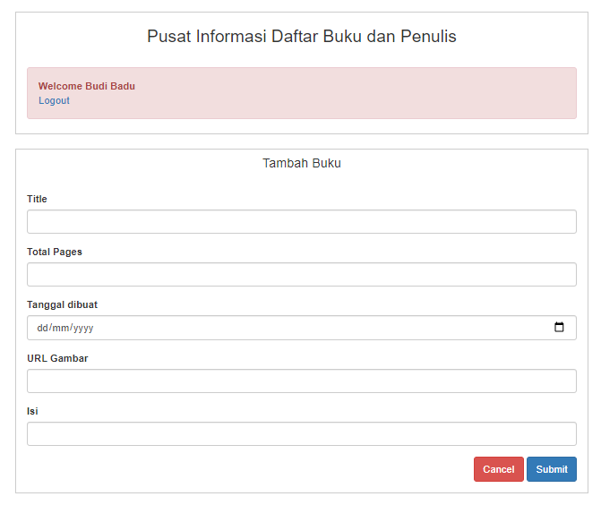

# Pusat Informasi Daftar Buku dan Penulis

* [Video Demo](https://drive.google.com/file/d/1Lo2SjT6h0jSs6o7eF5kaqTJKdtGKABuF/view?usp=sharing)
* [Api Documentation](API_Documentation.md)

## Tentang Projek
Pusat Informasi Daftar Buku dan Penulis merupakan aplikasi yang dapat digunakan untuk mengelola informasi di sebuah perpustakaan seperti informasi terkait buku dan penulis. Aplikasi ini dapat melakukan login untuk admin dan mengelola informasi terkait buku dan penulis. Pengguna yang berhasil login dapat melakukan pengelolaan informasi seperti melihat, menambahkan, mengedit, menghapus informasi terkait buku dan/atau penulis.

Aplikasi ini dibangun dengan framework Laravel. Informasi mengenai data pengguna, penulis, dan buku disimpan dalam sebuah basis data yang menggunakan PostgreSQL. 

## Rancangan Basis Data
Basis data yang digunakan dalam aplikasi ini adalah PostgreSQL. Terdapat 3 tabel penting di dalam basis data yaitu tabel `books`, `authors`, dan `authored_books`. Berikut ini Entity Relationship Diagram untuk basis data yang digunakan dalam aplikasi

 

## Screenshot Aplikasi

## Dependency
* axios 0.21
* laravel-mix 6.0.6
* lodash 4.17.19
* postcss 8.1.14